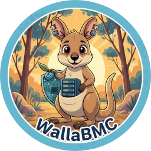
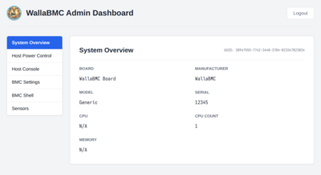

# WallaBMC

## Overview

WallaBMC is a simple, lightweight Baseboard Management Controller (BMC) firmware suitable for STM32 and similar class microcontrollers. Built on the Zephyr RTOS, WallaBMC provides essential BMC functionality including network management, host power control, and web-based administration through a Redfish-compliant interface.

WallaBMC is designed for embedded systems requiring BMC capabilities without the complexity of full-featured BMC solutions. It provides core functionality for monitoring and managing host systems through industry-standard interfaces.

### Features

* **LED Status Indicators**: Visual feedback for system status
* **IPv4 Networking**: Static IP or DHCP with mDNS hostname resolution
* **Redfish Interface**: Industry-standard RESTful API for management
* **Web Interface**: HTTP/HTTPS web UI for administration
* **BMC Console**: Management console accessible via serial or web interface
* **Persistent Configuration**: Settings stored across reboots
* **Host Power Control**: Power on/off management for host systems
* **Host Console**: Serial console access

### Hardware Support

WallaBMC currently supports the following hardware platforms:

| Hardware | Zephyr board name | Description |
| --- | --- | --- |
| **SiFive HiFive Premier P550 MCU** | hifive_premier_p550_mcu | RISC-V based platform |
| **STM32 Nucleo F767ZI** | nucleo_f767zi | ARM Cortex-M7 development board (standalone, no host CPU) |
| **Seeed Studio XIAO ESP32-C6** | xiao_esp32c6/esp32c6/hpcore | RISC-V, Wi-Fi 6, on a 21×17.5 mm board with USB-C; BMC console over USB Serial/JTAG (see [below](#seeed-xiao-esp32-c6)) |
| **qemu** | qemu_cortex_m3 | see [run_qemu_ci.py](scripts/run_qemu_ci.py) |

### Screenshot

The main page of the web interface is shown below, click to enlarge.

[](img/web-ui.png)

### Seeed XIAO ESP32-C6

The ESP32-C6 (RISC-V, Wi-Fi 6) on Seeed Studio's 21×17.5 mm XIAO form
factor with a USB-C connector. The BMC console runs over the SoC's
built-in USB Serial/JTAG (the XIAO's USB-C port), so a separate UART
(UART1) is free for the host serial bridge. Only three GPIOs on the
XIAO connector are needed for host control; the host UART pads stay
clear of the default I2C bus (D4/D5) and SPI bus (D8/D9/D10) so those
remain free for other uses.

#### Wiring

Four wires between the XIAO ESP32-C6 and the host board:

| XIAO pin | GPIO | Direction | Host signal | Notes |
| --- | --- | --- | --- | --- |
| D0 | GPIO0 | out | host UART RX | UART1 TX — host serial console (115200 8N1) |
| D3 | GPIO21 | in | host UART TX | UART1 RX — host serial console |
| D2 | GPIO2 | out (open-drain) | SYSRESET# input | Active-low, 1 s low pulse on `reset` / `power force-restart` |
| GND | — | — | GND | Common reference, required |

> **Voltage warning.** ESP32-C6 GPIOs are **not** 5 V tolerant. The
> SYSRESET# pin is driven open-drain, so it only sinks — the host's
> internal pull-up sets the un-asserted level. If the host holds that
> line above 3.3 V when un-asserted, add a small N-MOSFET (gate = ESP32
> GPIO, drain = host pin, source = GND) between them. The UART1 RX
> line (D3 / GPIO21) sees the host's TX voltage directly; if the host
> UART runs above 3.3 V, level-shift it.

#### Build and flash

The XIAO uses Espressif's built-in Simple Boot rather than MCUboot,
so the build skips ``--sysbuild``. Plug the XIAO into your build host
over USB-C — the same USB cable provides power, flashes the firmware,
and carries the BMC console:

```
# One-time: fetch the Espressif Wi-Fi/PHY binary blobs.
west blobs fetch hal_espressif

cd zephyr
west build -b xiao_esp32c6/esp32c6/hpcore ../wallabmc --pristine \
    -- -DCONFIG_DEFAULT_ADMIN_PASSWORD='"admin"'
west flash
```

The first time you boot a freshly flashed image with no baked-in
SSID, set the Wi-Fi from the BMC console (USB-CDC over the XIAO's
USB-C port):

```
wifi connect your-ssid your-password
```

The credentials are persisted in NVS and reused on every subsequent
boot. To bake an SSID into the image instead (for first-boot bring-up
without console access), add to the cmake line:

```
    -DCONFIG_WIFI_CREDENTIALS=y \
    -DCONFIG_WIFI_CREDENTIALS_STATIC=y \
    -DCONFIG_WIFI_CREDENTIALS_STATIC_SSID='"your-ssid"' \
    -DCONFIG_WIFI_CREDENTIALS_STATIC_PASSWORD='"your-password"' \
```

On boot the BMC associates to Wi-Fi, picks up a DHCPv4 lease, and
logs the address on the BMC console. Browse to ``http://<that-ip>/``
for the web UI; the BMC shell is available there, on the BMC USB-CDC
console, or (once the host is up) the host UART console is reachable
via the web UI's host-console terminal and TCP port 22.

#### Host control from the shell

```
power on              # 200 ms press on GPIO1 (if BMC believes host is off)
power off             # 200 ms press on GPIO1 (if BMC believes host is on)
power force-off       # 6 s press on GPIO1
power force-restart   # 1 s low pulse on GPIO2 (SYSRESET#)
reset                 # alias for power force-restart
```

## Using

### Prerequisites

Before getting started, ensure you have a proper Zephyr development environment. Follow the official [Zephyr Getting Started Guide](https://docs.zephyrproject.org/latest/develop/getting_started/index.html).

Required tools:

* West (Zephyr's meta-tool)
* CMake (version 3.20.0 or later)
* Python 3
* A toolchain for your target platform (ARM or RISC-V)
* OpenOCD or appropriate flashing tool for your hardware


### Quick instructions (existing zephyr build env)

Clone the repo into your home dir

```
cd $HOME
git clone https://github.com/tenstorrent/wallabmc.git
```

Go to your zephyr build dir:

```
west build --sysbuild -b nucleo_f767zi ~/wallabmc
```
Where `nucleo_f767zi` can be replaced with the boards in [Hardware Support](#hardware-support).

See [flashing](#flashing) on how to install

### Installation

For those without a pre-existing zephyr build env

#### Initialize Workspace

The first step is to initialize the workspace folder where WallaBMC and all Zephyr modules will be cloned:

```
# Initialize workspace for WallaBMC (main branch)
west init -m https://github.com/tenstorrent/wallabmc.git --mr main workspace
# update Zephyr modules
cd workspace
west update
```

#### Building

To build the application, run the following command:

```
cd zephyr
west build --sysbuild -b nucleo_f767zi ../wallabmc
```

Where `nucleo_f767zi` can be replaced with the boards in [Hardware Support](#Hardware-Support)

### Supported boards:

See the [Hardware Support](#Hardware-Support) section.

### Flashing

```
west flash --runner openocd
```

Alternatively, use the `build/wallabmc/zephyr/zephyr.signed.hex` and
`build/mcuboot/zephyr/zephyr.hex` files, and run the openocd commands:

```
flash write_image erase build/mcuboot/zephyr/zephyr.hex
flash write_image erase build/wallabmc/zephyr/zephyr.signed.hex
```
Also see instructions on [flashing the p550](boards/sifive/hifive_premier_p550_mcu/support/README.md)

### Running

When the system has booted, a slow-blinking status LED indicates the system
is running.

The Nucleo exposes an STM32 UART as a serial device over the USB port.
WallaBMC puts the BMC console on this serial device that displays boot
and log messages, and can be used to query and configure the device.

WallaBMC supports networking over ethernet and by default uses DHCP with the
hostname ``wallabmc`` to get an IP address.

WallaBMC opens an HTTP (and possibly HTTPS) port, which provides Redfish and
Web UI. The Web UI can also access the BMC console.

## BMC shell

The Zephyr shell has been extended with wallabmc commands, and can be accessed
via the MCU serial console or the WebUI or websocket.

The websocket BMC shell endpoint URL is /console/bmc and supports ws and
wss if ``CONFIG_APP_HTTPS`` (e.g., ``wss://wallabmc.local.net/console/bmc``).

## Host serial console

The Nucleo has USART6 connected to pins D0/D1 RX/TX on the CN10 connector.
WallaBMC uses this as the host serial console which can be accessed with
the WebUI terminal or telnet port 22. The pins would have to be connected
to something useful (e.g., each other have a loopback UART that echoes back
what is transmitted to it).

The P550 host serial console UART is connected to an actual serial console
UART on the host CPU.

The websocket host console endpoint URL is /console/host and supports ws and
wss if ``CONFIG_APP_HTTPS`` (e.g., ``wss://wallabmc.local.net/console/host``).

### Settings and configuration

* ``help`` command listing with hierarchical help (e.g., ``help config``).
* ``config`` shell command can be used to configure the BMC.
* ``power`` can power the host on and off. On the Nucleo board there is no
  host CPU so one of the LEDs is a stand-in for a host power GPIO.

## Contributing

See [CONTRIBUTING.md](CONTRIBUTING.md) for information on how to contribute to this project.

## License

This project is licensed under the terms described in:

* [LICENSE](LICENSE) – code license
* [LICENSE_understanding.txt](LICENSE_understanding.txt) – license summary and clarification
* [LICENSE-DOCS](LICENSE-DOCS) – Creative Commons license for all documentation and logos
